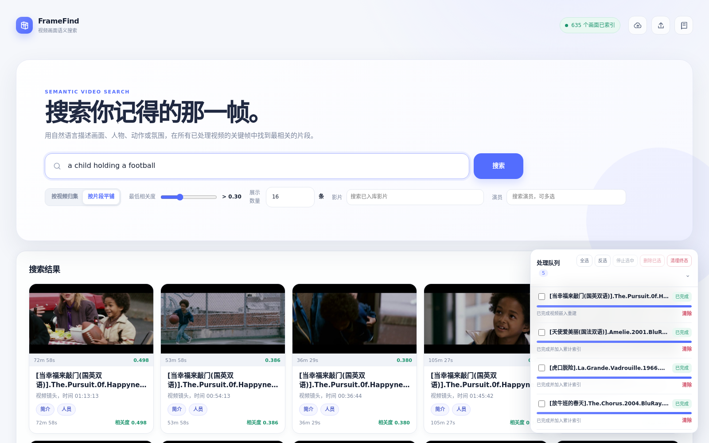
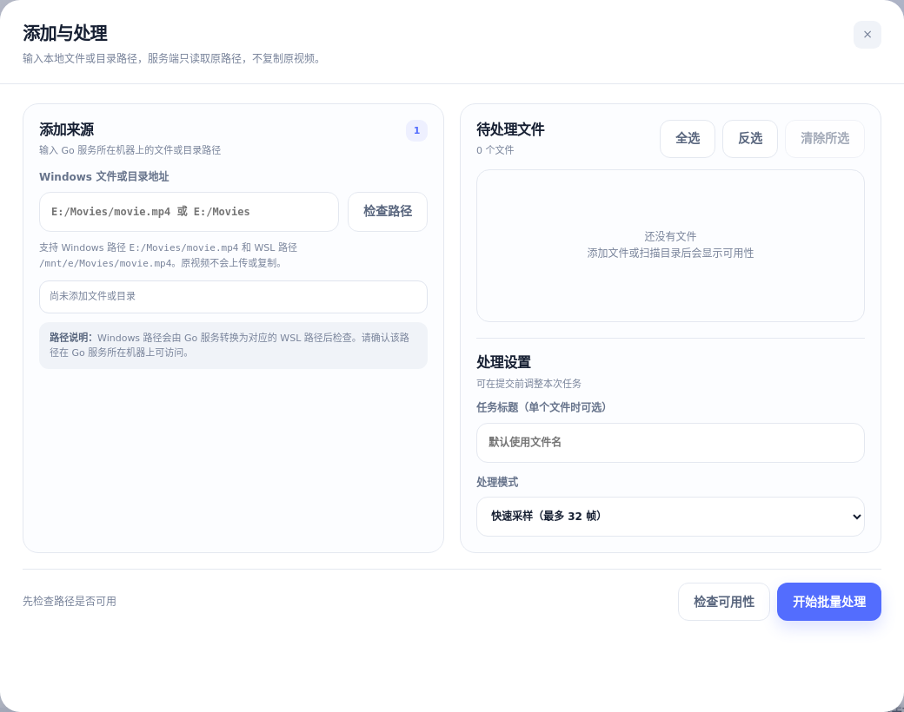
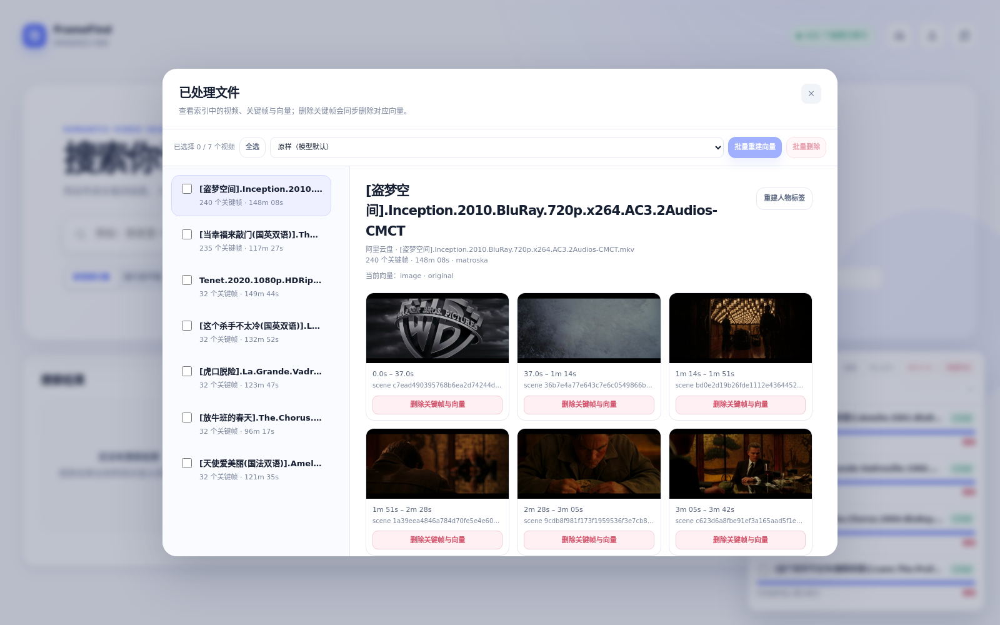

# Video Semantic Search

[中文](README.md) · English

A Go-first video semantic search engine MVP, with Python used only for model
inference.

It parses videos into keyframes or representative frames, builds a scene-level
index with multimodal embeddings, and searches by natural-language descriptions
to return matching videos, time ranges, and accessible previews. Optional
integrations provide face recognition, IMDb/TMDB metadata, Aliyun Drive remote
videos, and external player controls.

## Features

- Go handles the HTTP API, task queue, video parsing, remote Range reads,
  indexing, retrieval, static assets, and the Web UI.
- The Python embedding service provides an offline `hash` backend and the
  Tencent WeMM multimodal backend.
- Text queries and image scenes use the same vector space. WeMM outputs
  normalized 2048-dimensional vectors by default and results are ranked by
  cosine similarity.
- Supports fast sampling and keyframe/accurate sampling. Fast mode defaults to
  at most 32 frames and accurate mode to at most 240 frames.
- Supports remote metadata parsing and keyframe Range reads for MP4 and
  Matroska/WebM without downloading the entire remote video.
- Deduplicates by content SHA-256, so identical content is not processed twice.
- Provides asynchronous tasks, progress SSE, batch stop, batch deletion, and
  embedding rebuild operations.
- Supports `small`, `tiny`, or custom-size static preview URLs.
- Optionally integrates InsightFace, IMDb, and TMDB for actor filtering and
  scene face labels.
- Optionally integrates Aliyun Drive for QR-code login, file browsing, and
  remote video processing.
- Provides an API for seeking, playing, and closing a player in an open Web
  page.

## Architecture

```text
                 ┌─────────────────────────────┐
                 │          Go Search API       │
                 │  UI / Tasks / Index / Media  │
                 └──────────────┬──────────────┘
                                │ HTTP
             ┌──────────────────┴──────────────────┐
             │                                     │
   ┌─────────▼─────────┐                ┌──────────▼─────────┐
   │ Python Embedding  │                │ Python Identity     │
   │ WeMM or hash      │                │ InsightFace optional│
   └───────────────────┘                └────────────────────┘

  video → metadata/I-frames → representative frames → embeddings → search
```

The Go and Python services communicate through simple HTTP JSON APIs and can
be deployed independently. Default storage uses a file index and SQLite, with
no external database required. PostgreSQL, Qdrant, or another vector store can
be added behind an adapter later.

For independent installation, API, and configuration details for the Python
services, see [`python/README.md`](python/README.md).

## Docker Compose quick start

The repository provides three images: the Go search service, the WeMM
embedding service, and the optional InsightFace Identity service. The Go image
includes `ffmpeg`/`ffprobe`. The GPU images use CUDA 12.8, while model weights
are downloaded on first startup into Docker cache volumes instead of being
baked into the images.

WeMM and InsightFace require an NVIDIA driver, NVIDIA Container Toolkit, and a
GPU-enabled Docker installation. To validate the API loop without model
downloads, set both backends to `hash` in `docker/.env.example`.

```bash
cp docker/.env.example docker/.env
# Edit docker/.env and add HF_TOKEN, TMDB_API_KEY, or other optional settings.
mkdir -p media
docker compose --env-file docker/.env -f docker/compose.yaml pull
docker compose --env-file docker/.env -f docker/compose.yaml up -d
curl -fsS http://localhost:8000/healthz
```

Only the Go service is exposed on port `8000` by default; embedding and
Identity communicate over the internal Compose network. The first startup
downloads the WeMM and InsightFace weights. Later startups reuse the
`hf-cache` and `insightface-cache` volumes. To process local videos, put them
under `media/` and use container paths such as `/media/<filename>` in the UI or
API. Set `VIDEO_SEARCH_MEDIA_DIR` to map `/media` to another host directory.

The default is the Docker Hub `clean-release-v1.0` tag; change `IMAGE_TAG` when
upgrading to another release. Developers who need to rebuild from source can
run `docker compose ... up -d --build`.

```bash
docker compose --env-file docker/.env -f docker/compose.yaml logs -f
docker compose --env-file docker/.env -f docker/compose.yaml down
```

Never copy a `docker/.env` containing tokens into an image or commit it to Git.

## Requirements

- Go 1.22 or later
- Python 3.10 or later
- `ffmpeg` and `ffprobe`
- A platform-compatible PyTorch installation for WeMM; GPU/CUDA is optional
- InsightFace and its ONNX Runtime dependencies for face recognition
- IMDb bulk datasets and a TMDB API key for IMDb/TMDB synchronization

The Python requirements files do not force a particular CUDA/cuBLAS version.
Install a PyTorch build appropriate for the target machine according to the
official PyTorch instructions, then install project dependencies:

```bash
python3 -m pip install -r python/requirements-model.txt
python3 -m pip install -r python/requirements-identity.txt  # optional
```

If a usable PyTorch environment already exists, install only the additional
packages:

```bash
python3 -m pip install -r python/requirements-model-extra.txt
```

## Quick start

### 1. Build the Go service

```bash
go build -o bin/search-server ./cmd/search-server
```

### 2. Start the offline embedding backend

The `hash` backend does not understand real images. It is only suitable for
checking the API, task queue, and indexing loop; it does not represent real
visual search quality.

```bash
EMBEDDING_BACKEND=hash \
EMBEDDING_HOST=127.0.0.1 \
EMBEDDING_PORT=7001 \
python3 python/embedding_service.py
```

### 3. Start the Go service

In another terminal:

```bash
./bin/search-server
```

The default address is <http://localhost:8000>. Check the service and
embedding status with:

```bash
curl -fsS http://localhost:8000/healthz
```

### 4. Start WeMM

After installing model dependencies, switch the embedding backend to WeMM:

```bash
EMBEDDING_BACKEND=wemm \
WEMM_MODEL=tencent/WeMM-Embedding-2B \
EMBEDDING_DIMENSION=2048 \
EMBEDDING_DEVICE=auto \
EMBEDDING_BATCH_SIZE=8 \
python3 python/embedding_service.py
```

The model is downloaded by the Hugging Face client and stored in its standard
cache. If authentication is required, provide the Hugging Face token through
the runtime environment; never commit it or put it in shell history. If GPU
memory is insufficient, reduce `EMBEDDING_BATCH_SIZE` first.

The startup script can also be used:

```bash
PYTHON_BIN=python3 PROXY_URL=direct scripts/start_embedding.sh --no-server
```

The script accepts overrides such as `PYTHON_BIN`, `PROXY_URL`, and
`EMBEDDING_BACKEND`. It only starts the service and never writes credentials
into the repository.

## Web UI walkthrough

Open <http://localhost:8000> after starting the Go service. The screenshots
below come from a real running instance; movie titles, queries, scores,
timestamps, and keyframes come from an actual index, while server-local paths
are hidden.

### Search

Enter a natural-language description of a scene, person, action, or mood and
click **Search**. For example, `a child holding a football` matched real
keyframes from *The Pursuit of Happyness*. The screenshot uses scene-flat mode,
which shows each matching segment, timestamp, and score; results can also be
grouped by video.



### Add and process videos

Click the upload icon in the upper-right corner and enter a file or directory
path accessible to the Go service. A file can be added directly to the pending
list. For a directory, click **Scan directory** and choose whether scanning is
recursive. Check availability, choose fast sampling or keyframe detection, and
click **Start batch processing**.



### Task progress

After submission, the task queue receives status and progress updates over SSE.
It supports select all, invert selection, stopping unfinished tasks, and
deleting completed, failed, or stopped records.


### File management

Click the management icon to view processed videos and keyframes. Select one or
more videos to rebuild `original` or `compressed` embeddings in batch, or delete
entire files. Inside a video detail view, an individual keyframe and its vector
can also be deleted.



## Importing and processing videos

### JSONL import

Use this when scene or keyframe descriptions already exist:

```bash
go run ./cmd/ingest -file /path/to/media.jsonl
```

Individual media objects can also be imported with `POST /v1/media`.

### Video acquisition tasks

Paths entered in the browser must be accessible to the host running the Go
service. The browser does not upload or copy the original video. The service
accepts Unix, Windows, and WSL-style path conversion, but the final path must
be visible on the server.

```bash
curl -fsS -X POST http://localhost:8000/v1/acquisitions \
  -H 'content-type: application/json' \
  -d '{
    "local_path": "/path/to/movie.mp4",
    "source_name": "movie.mp4",
    "fast_mode": true
  }'
```

Batch submission:

```bash
curl -fsS -X POST http://localhost:8000/v1/acquisitions/batch \
  -H 'content-type: application/json' \
  -d '{
    "items": [
      {"local_path": "/path/to/movie-1.mp4", "fast_mode": true},
      {"local_path": "/path/to/movie-2.mkv", "fast_mode": true}
    ]
  }'
```

Submission returns immediately. The background pipeline handles metadata,
content fingerprinting, container parsing, frame extraction, face labels, and
embedding. Query progress with `GET /v1/acquisitions` or subscribe to
`GET /v1/acquisitions/events` for SSE events.

Fast mode is intended for interactive indexing and normally samples at fixed
intervals. Accurate mode prioritizes container keyframes and performs shot
boundary detection. The current limits are controlled by
`VIDEO_FAST_MAX_SCENES` and `VIDEO_MAX_SCENES`, defaulting to 32 and 240.

For remote Aliyun Drive videos, the service attempts to read only container
metadata and target I-frames:

1. Detect the container and read MP4 `moov` or Matroska `SeekHead`/`Cues`.
2. Obtain exact byte ranges for keyframes.
3. Download only target ranges and let FFmpeg decode them to JPEG.
4. Send representative frames to the embedding service.

If the container has no usable index or the format is unsupported, the system
may fall back to sequential chunk reads. Task results record remote-read and
index-cache information.

## Search

```bash
curl -fsS -X POST http://localhost:8000/v1/search \
  -H 'content-type: application/json' \
  -d '{
    "query": "a red car passing through a street at night",
    "limit": 16,
    "min_score": 0.3,
    "mode": "scene"
  }'
```

The network-friendly GET endpoint is also available:

```text
GET /v1/search?q=a%20red%20car%20passing%20through%20a%20street&limit=16&mode=scene
```

Search modes:

- `mode=media`: group by video and return each video's best matching segment.
- `mode=scene`: flatten results and return scene-level matches.

WeMM retrieval uses `encode_query`, `encode_document`, and normalized vectors;
results are sorted by descending cosine similarity. `limit` controls the number
of returned videos or scenes. `min_score` is an optional filter.

## Previews, playback, and external controls

Search results contain absolute `preview` URLs. Stable static routes are also
available:

```text
GET /static/frames/{media_id}/{filename}
GET /static/frames/{media_id}/{filename}?size=small
GET /static/frames/{media_id}/{filename}?size=tiny
GET /static/frames/{media_id}/{filename}?width=320&height=240&quality=80
```

`small` is limited to 320×240 and `tiny` to 160×120; resizing preserves the
original aspect ratio.

Video playback:

```text
GET /v1/media/{media_id}/stream
```

External programs can control a player in an already open Web page:

```bash
curl -fsS -X POST http://localhost:8000/v1/player/control \
  -H 'content-type: application/json' \
  -d '{
    "action": "open",
    "media_id": "<media-id>",
    "time": 123.45,
    "autoplay": true,
    "fullscreen": true
  }'

curl -fsS -X POST http://localhost:8000/v1/player/control \
  -H 'content-type: application/json' \
  -d '{"action":"close"}'
```

The player receives commands over SSE. Browser security rules may reject
automatic fullscreen because it requires transient user activation; the page
provides a click confirmation when needed.

## Optional face recognition and IMDb/TMDB

The face pipeline is disabled by default. Start the Identity Service first:

```bash
IDENTITY_BACKEND=insightface \
IDENTITY_DEVICE=auto \
PYTHON_BIN=python3 \
scripts/start_identity.sh
```

Then start the Go service with:

```bash
IDENTITY_ENABLED=true \
IDENTITY_ENDPOINT=http://127.0.0.1:7003 \
TMDB_API_KEY=<your-tmdb-api-key> \
./bin/search-server
```

The Identity Service detects faces and creates 512-dimensional vectors. Go
handles IMDb/TMDB metadata, actor relationships, reference-image lifecycle,
thresholds, and scene labels. Lazy loading is enabled by default: TMDB profile
images and missing face vectors are loaded only when a processed movie contains
the corresponding IMDb actors. Reference images are deleted after inference by
default; only vectors and source metadata are retained. Set
`IDENTITY_KEEP_REFERENCE_IMAGES=true` if manual review is required.

Import IMDb bulk data with `catalog-sync`:

```bash
scripts/download_imdb_datasets.sh
go build -o bin/catalog-sync ./cmd/catalog-sync

./bin/catalog-sync \
  --imdb-basics data/imdb/title.basics.tsv.gz \
  --imdb-ratings data/imdb/title.ratings.tsv.gz \
  --imdb-principals data/imdb/title.principals.tsv.gz \
  --imdb-names data/imdb/name.basics.tsv.gz \
  --imdb-akas data/imdb/title.akas.tsv.gz \
  --imdb-crew data/imdb/title.crew.tsv.gz \
  --title-id-file data/imdb/title-ids.txt \
  --tmdb
```

Use bounded selection with `--title-id-file`, `--max-movies`, or a year range
for `--tmdb`; otherwise an entire catalog may be synchronized unintentionally.
Provide tokens, API keys, and login credentials through environment variables
or an untracked `.env` file.

## Aliyun Drive

The cloud-drive entry in the upper-right corner supports QR-code login and file
browsing. The default flow uses the tickstep login path and does not put a
personal token in the browser. For official OAuth, configure:

```bash
ALIYUNPAN_LOGIN_MODE=official
ALIYUNPAN_CLIENT_ID=<your-client-id>
ALIYUNPAN_CLIENT_SECRET=<your-client-secret>
ALIYUNPAN_REDIRECT_URI=oob
```

Login credentials are stored only in the server's configured runtime directory.
Never commit `.env`, token files, or cloud-drive caches.

## Configuration

| Environment variable | Default | Description |
| --- | --- | --- |
| `VIDEO_SEARCH_ADDR` | `:8000` | Go HTTP listen address |
| `VIDEO_SEARCH_INDEX` | `data/index.json` | Media and scene index |
| `VIDEO_SEARCH_FRAME_DIR` | `data/frames` | Representative-frame directory |
| `VIDEO_SEARCH_TASK_FILE` | `data/acquisition_tasks.json` | Task state file |
| `VIDEO_SEARCH_PUBLIC_URL` | Request Host | Public base URL for preview links |
| `EMBEDDING_ENDPOINT` | `http://127.0.0.1:7001` | Python embedding service |
| `EMBEDDING_BACKEND` | `hash` | `hash` or `wemm` |
| `EMBEDDING_DIMENSION` | `256`/`2048` | Depends on the embedding backend |
| `EMBEDDING_DEVICE` | `auto` | `auto`, `cuda`, or `cpu` |
| `EMBEDDING_BATCH_SIZE` | `8` | Embedding batch size |
| `VIDEO_FAST_MODE` | `false` | Enable fast sampling by default |
| `VIDEO_FAST_MAX_SCENES` | `32` | Fast-mode frame limit |
| `VIDEO_MAX_SCENES` | `240` | Accurate-mode frame limit |
| `VIDEO_FRAME_WORKERS` | `4` | Frame extraction concurrency |
| `VIDEO_REMOTE_RANGE_WORKERS` | `4` | Remote Range-request concurrency |
| `VIDEO_REMOTE_MP4_MOOV_WORKERS` | `4` | MP4 metadata chunk concurrency |
| `VIDEO_IMAGE_BATCH_SIZE` | `32` | Image batch size sent to embedding |
| `VIDEO_IMAGE_PROFILE` | `original` | `original` or `compressed` |
| `IDENTITY_ENABLED` | `false` | Enable actor/face processing |
| `IDENTITY_ENDPOINT` | `http://127.0.0.1:7003` | Identity Service address |
| `IDENTITY_LAZY_LOAD` | `true` | Lazy-load actor reference images |
| `IDENTITY_MIN_REFERENCES` | `5` | Minimum reference vectors for an actor candidate |
| `TMDB_API_KEY` | unset | TMDB metadata and profile-image source |

Runtime data, indexes, images, caches, and logs should remain in ignored
directories. In production, set paths explicitly and never use a shared
directory that contains credentials.

## API overview

| Method | Path | Purpose |
| --- | --- | --- |
| `GET` | `/healthz` | Service and embedding status |
| `POST` | `/v1/search` | JSON search |
| `GET` | `/v1/search` | Network-friendly query-parameter search |
| `POST` | `/v1/media` | Import existing media/scene data |
| `GET` | `/v1/media` | List indexed media |
| `GET` | `/v1/media/{id}` | View media and scenes |
| `POST` | `/v1/acquisitions` | Submit one video-processing task |
| `POST` | `/v1/acquisitions/batch` | Submit multiple video tasks |
| `GET` | `/v1/acquisitions/events` | Task SSE event stream |
| `POST` | `/v1/acquisitions/batch/stop` | Stop multiple tasks |
| `POST` | `/v1/acquisitions/batch/delete` | Delete terminal task records |
| `POST` | `/v1/media/embeddings/rebuild` | Rebuild embeddings in batch |
| `POST` | `/v1/media/batch/delete` | Delete media and scenes in batch |
| `GET` | `/static/frames/...` | Access representative frames and thumbnails |
| `POST` | `/v1/player/control` | Control a player in an open page |

## Data format

`POST /v1/media` and JSONL import accept media objects such as:

```json
{
  "media_id": "movie-001",
  "type": "movie",
  "title": "Example Movie",
  "year": 2024,
  "language": ["en"],
  "description": "A short description.",
  "tags": ["action"],
  "scenes": [
    {
      "start": 0,
      "end": 10,
      "preview": "https://example.invalid/frame.jpg",
      "caption": "A person running through snow",
      "subtitle": "We have to go back."
    }
  ]
}
```

Video acquisition tasks generate real `start`, `end`, `preview`, and
`preview_path` values. Original videos are not written into the index directory.

## Security and deployment notes

- Never commit `.env`, API keys, OAuth secrets, access tokens, refresh tokens,
  or cloud-drive configuration files.
- The service listens on the loopback interface by default. Set the listen
  address and `VIDEO_SEARCH_PUBLIC_URL` explicitly for LAN access.
- The service currently has no built-in user authentication. Put it behind an
  authenticated gateway or on a private network before exposing it publicly.
- Restrict directories accessible to the Go process when enabling server-side
  path processing; do not expose arbitrary untrusted input directly.
- The browser submits paths only. It does not grant the server access to local
  browser files; the path must be readable by the server.
- Reference images are temporary face-inference inputs by default and are
  deleted after successful inference. Protect the storage directory if retained.

## Known limitations

- The `hash` backend is for integration tests only and has no visual or face
  understanding.
- WeMM's first startup downloads a model; GPU memory, batch size, and image
  profile affect throughput.
- Automatic fullscreen is subject to browser security policy and may require a
  user click.
- Remote fragmented MP4, Matroska files without usable Cues, laced blocks, and
  MPEG-TS/AVI may still fall back or fail.
- The file index is intended for MVP and single-instance deployments. Large
  multi-instance deployments should use shared storage and a dedicated vector
  database.

## Development and testing

```bash
go test ./...
go vet ./...
```

Runtime indexes, tasks, frames, model caches, and logs should not enter version
control. Before committing, check:

```bash
git status --short --ignored
git diff --check
```

## License

This project is licensed under the Apache License 2.0. See [LICENSE](LICENSE).

The Aliyun Drive integration uses
[`github.com/tickstep/aliyunpan-api`](https://github.com/tickstep/aliyunpan-api)
v0.2.9, which is also distributed under Apache License 2.0. See
[THIRD_PARTY_NOTICES.txt](THIRD_PARTY_NOTICES.txt) for attribution details.
